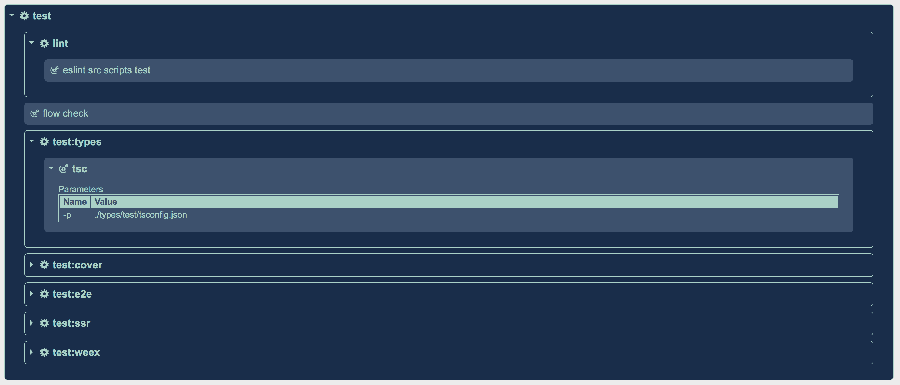

# NPMAPPER
Map your NPM scripts in a human-friendly way to get a good overview on what's **really** going on in your package.json file

## Installation & usage
You can use the tool without the need to permanently installing it, by using `npx`.<br>
The simplest way to do so is running the following command, which will execute `npmapper` on the directory from which it was called:
``` 
npx npmapper
```
See more option on the Example section below...

## Features
Feature | Description
------------ | -------------
Single script or all | You can tell `npmapper` to either go through the entire scripts on the package.json file or just a single one, using the `-s` params (see Parameters section below)  
Auto-extract Pre & Post scripts | The tool will auto-extract the Pre and Post scripts if they exist
Extract action's parameters | An action, which can be a call to any node script, bash, npm script etc., can have params to it which `npmapper` will attempt to extract and display in a table
Script delegation | Trace scripts as they call nested scripts within the same package.json or even delegating to an **external** package.json file 
Cross-project mapping | You have a script which uses the `--prefix` parameter to call another script under a different project? Now you can trace that path nicely 
Resolve NPM config values | Values which are defined under the package.json config property can be resolved to their value (currently supported only for the `--prefix` parameter)
Report types | Supports JSON and HTML report types
Human friendly | Visual separation between NPM scripts and commands, collapsing and expanding nested scripts and table visualization of parameters

## Parameters
Parameter | Description
------------ | -------------
-d | The target directory, defaults to the directory the npmapper is being launched from
-s | The script name, the single script name to map, if left empty npmapper will attempt to map the entire scripts
-t | The report type, can be HTML or JSON. default is HTML

## Examples
``` 
npx npmapper
```
Execute npmapper on the directory from which it was called, attempting to read a package.json file there.<br>
This will produce an HTML report residing on a `npmapper` directory under the directory from which the tool was invoked<br><br>

``` 
npx npmapper -d ~/my-projects/super/dir
```
Execute npmapper on the `~/my-projects/super/dir` directory, attempting to read a package.json file there.<br>
This will produce an HTML report residing on a `npmapper` directory under the directory from which the tool was invoked<br><br>

``` 
npx npmapper -d ~/my-projects/super/dir -s build
```
Execute npmapper on the `~/my-projects/super/dir` directory, attempting to read a package.json file there and map only the `build` script<br>
This will produce an HTML report residing on a `npmapper` directory under the directory from which the tool was invoked<br><br>

``` 
npx npmapper -d ~/my-projects/super/dir -t json
```
Execute npmapper on the `~/my-projects/super/dir` directory, attempting to read a package.json file there.<br>
This will produce an JSON report residing on a `npmapper` directory under the directory from which the tool was invoked<br><br>

### Checkout Vue.js `test` script mapped
An HTML report example of running npmapper on `Vue.js` package.json file, only for the `test` script:<br><br>


## Reports
The `npmapper` tool currently supports 2 types of reports: HTML and JSON.<br>
You will probably obtain better understanding from the HTML report and this is why it is the default report. Once you run the tool it will generate and attempt to open the HTML report on your default browser.<br>
The JSON report is the plain data structure which other reports can be built upon.<br> 
**Please note**: `npmapper` will attempt to write the report's content to your file system, under the directory which `npmapper` was launched from, so make sure it can do that.

## Disclaimers
Whether some features are still missing or some are very hard to support, here is a list of some issues the tool still cannot perform at this point in time -<br>

NPM scripts can hold pretty much any command, without enforcing any standards on how they are written. Parsing the scripts content involves RegExp and would be extremely difficult to cover **all** permutations out there.<br>
The tool tries not to break under an unsupported permutation it parses, but that can happen, and if it does, please open an issue for it.<br>
The tool works best under the following assumptions:
* Parameters should follow the command, e.g. `npm install --quiet` (not `npm --quiet install')
* The tool supports sequence invoking, e.g. `&&` separating one action from the next, and will consider parallel actions, separated by `&`, as a single command.

`Yarn` is still not supported, but here's a nice PR for you to submit ;)

## Contributing
There is still a lot of ground to cover in the project and your help is welcomed and appreciated!
To name a few features which are laying on the ground ready to be picked: 
* Extend tests coverage
* Support Yarn
* Support multi selected scripts
* Support parsing params which are injected to a node script (e.g. `-- --paramName`)
* Support `npm-run-all`

And you must have several on your mind right now - don't hesitate to submit your PR :)


## Tests
In order to run the test, simply run the following command:
```
npm test
```
To get the tests coverage report run the following command:
```
npm test -- --coverage
```

## Thanks
https://alligator.io/ for their [great article on Collapsible impl.](https://alligator.io/css/collapsible/)<br>
https://icofont.com/ for their cool icons


